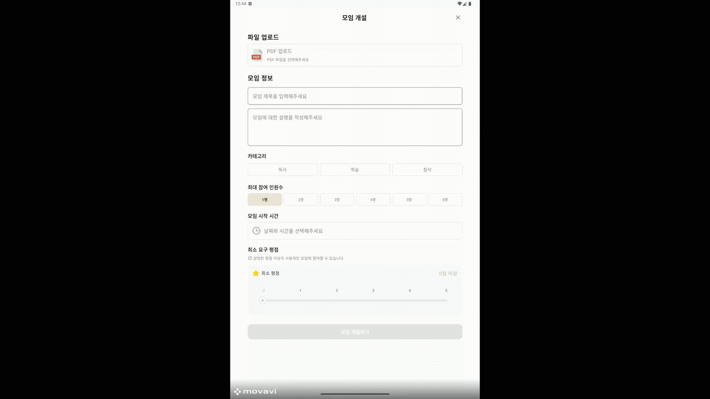
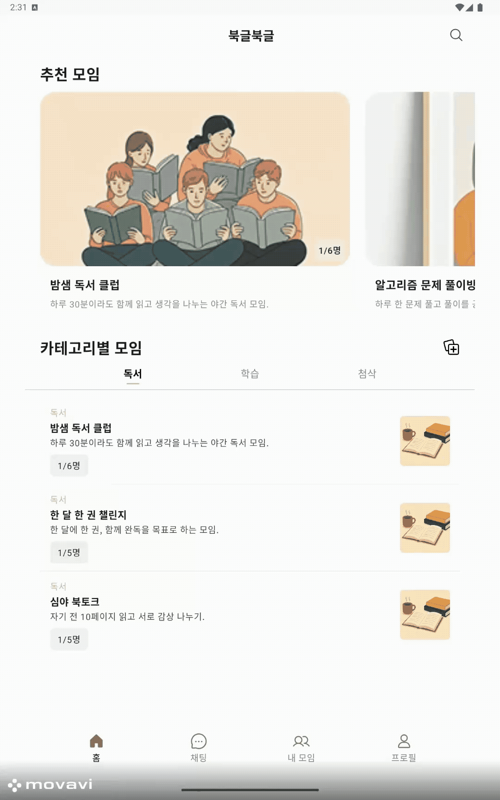

# TEAM 북치고 책펼치고 "북글북글(Bookgle)"

### 🏆SSAFY 13기 공통프로젝트 내마음속최우수상🏆

> 실시간 PDF 공유 플랫폼 "북글북글"
> 
> 
> PDF를 함께 읽고, 토론 및 퀴즈까지 – 북글북글 하나로 실시간 공유
> 

 

## 📑 목차

1. [프로젝트 소개](#-프로젝트-소개)
2. [주요 기능](#-주요-기능)
3. [주요 화면 및 기능 소개](#-주요-화면-및-기능-소개)
4. [주요 기술](#-주요-기술)
5. [기술 스택](#-기술-스택)
6. [아키텍처](#-아키텍처)
7. [팀원 정보](#-팀원-정보)

 

## 📋 프로젝트 소개

📚 **북글북글(BookgleBookgle)** 은 PDF 문서를 함께 읽고 토론할 수 있는

실시간 페이지 동기화 PDF 문서 공유 플랫폼입니다.

혼자만의 공부가 아닌, 그룹을 만들어 함께 읽으며 토론하고,

페이지 이동과 하이라이트까지 동기화되는 새로운 학습 경험을 제공합니다.

OCR 기능을 통해 이미지 기반 PDF도 텍스트로 변환하고,

AI와 함께 토론을 확장하며 더 깊이 있는 학습과 토론을 즐길 수 있습니다.

단순한 문서 뷰어를 넘어,

**읽기·토론·학습이 하나로 연결되는 서비스**가 북글북글입니다.

### 프로젝트 정보

| 항목 | 내용 |
| --- | --- |
| 팀명 | 북 치고 책 펼치고 |
| 서비스명 | 북글북글(bookglebookgle) |
| 개발 기간 | 2025.07.14 ~ 2025.08.18 (6주) |
| 개발 인원 | 5명 / 백엔드(2), 모바일(2), AI(1) |

 

## ✨ 주요 기능

### 1. PDF 업로드 & 관리

사용자가 가진 PDF 문서를 서버에 업로드하고 그룹별로 공유할 수 있습니다.

스터디 자료, 교재, 논문 등 다양한 PDF 문서를 한 곳에서 편리하게 관리할 수 있습니다.

### 2. 실시간 문서 동기화 & 주석 공유

그룹 리더가 페이지를 넘기면 모든 사용자의 화면이 동시에 이동합니다.

또한 문서에 표시한 하이라이트와 주석이 그룹 전체에 실시간으로 반영되어,

모두가 같은 페이지를 보며 강조와 메모를 함께 공유할 수 있습니다.

### 3. 채팅 & 토론

문서를 읽으며 실시간으로 채팅하거나 댓글을 작성할 수 있습니다.

즉각적인 의견 교환과 기록이 가능해 협업 독서 경험을 강화합니다.

### 4. AI 학습 지원

gRPC 기반 AI 서버와 연동하여 토론 주제를 확장하거나 토론 진행을 도와줍니다.

또한 읽은 내용을 기반으로 자동 퀴즈를 생성해 학습 내용을 복습하고 이해도를 점검할 수 있습니다.

AI가 참여하여 학습과 토론을 더 깊고 효과적으로 만들어 줍니다.

### 5. OCR 처리

이미지 기반 PDF도 OCR 기술로 텍스트를 추출해 검색과 분석이 가능합니다.

텍스트 추출을 통해 보다 유연한 학습과 자료 활용을 지원합니다.

 

## 🚀 주요 화면 및 기능 소개

### 1. 홈화면

- 맞춤형 문서 공유 모임 추천
- 카테고리별 모임 표시 (📚 독서 / 📖 스터디 / ✍ 첨삭)
- 빠른 접근을 위한 하단 네비게이션 제공

### 2. 모임 등록

- 저장소에서 PDF 파일 선택 후 모임 생성
- 이미지 PDF의 경우 OCR(Tesseract) 자동 처리
- 백그라운드 OCR 작업으로 앱 성능 저하 최소화

### 3. 모임 관리

- 참여 중인 모든 모임 리스트 조회
- 카테고리별 필터, 내가 만든 모임만 보기 지원

### 4. 모임 상세 보기

- 제목, 설명, 일시, 참여자 정보 제공
- 프로필 아바타 클릭 시 멤버 상세 정보 & 개인 진도율 확인
- 모임 전체 진도율 표시
- 모임 종료 후 팀원 평점 등록

### 5. PDF 뷰어 & 동기화

- 모임 내 공유된 PDF를 실시간 열람
- **FREE 모드**: 개인이 원하는 페이지 자유롭게 이동
- **FOLLOW 모드**: 방장의 페이지/줌/위치 실시간 동기화
- 하이라이트 및 주석 실시간 공유

- 방장 권한 위임 가능
- PDF 내 채팅 기능 제공

### 6. 실시간 채팅

- 모임별 전용 채팅방 제공
- PDF 뷰어와 동시에 사용 가능 (하단에 채팅창 배치)
- gRPC 기반 통신으로 빠르고 안정적인 대화

### 7. AI 토론 & 퀴즈

- 카테고리별 맞춤 AI 기능
    - 📚 **독서 모임**: AI 사회자 역할, 토론 주제 제시 & 참여 유도
    - 📖 **스터디 모임**: 학습 퀴즈 생성 및 풀이 지원
    - ✍ **첨삭 모임**: 자기소개서 첨삭 및 피드백 제공

### 8. 내 프로필

- 사용자 기본 정보 확인 및 수정
- 프로필 이미지 변경
- 사용자 통계 정보 확인

 

## 🔬 주요 기술

<strong>OCR + PdfBox-Android</strong>

> 이미지 기반 PDF의 텍스트 인식 및 활용 시스템 
> 
> 
> 스캔본이나 이미지 형태의 PDF에서 텍스트를 자동으로 추출하고, 학습과 토론에 활용할 수 있도록 변환하는 기술입니다.
> 
- **Tesseract OCR (Python 서버)**: 이미지 기반 PDF에서 텍스트를 정확하게 추출
- **gRPC 연동**: Spring Boot 서버와 Python OCR 서버 간의 실시간 데이터 송수신
- **사용자 경험**: 텍스트 검색, 하이라이트, 주석 기능을 이미지 PDF에서도 동일하게 활용 가능

<strong>gRPC</strong>

> **gRPC 기반 양방향 스트리밍**을 통해 PDF 주석/하이라이트 동기화, 실시간 채팅, AI 토론, 퀴즈를 저지연으로 처리 
**실시간 상태 관리 & 이벤트 브로커** 역할을 수행하여 클라이언트 간 화면, 메시지, 퀴즈 진행 상황을 즉시 공유
> 
- **PDF 동기화**: pdfium 기반 좌표·주석 데이터를 gRPC 스트림으로 전송, 참여자 화면에 즉시 반영해 공동 뷰어 환경 제공
- **실시간 채팅**: 텍스트 메시지를 gRPC 스트림으로 브로드캐스트, REST API와 함께 페이징·읽음처리로 안정성 확보
- **AI 토론**: AI 응답을 별도 스트림으로 받아 토론 상태 관리 및 주제 추천, 연결 타임아웃 시 자동 종료 처리
- **퀴즈 기능**: 문제·정답 공개·요약을 단계별 메시지 타입으로 관리, 타이머·자동 제출 로직과 함께 gRPC 이벤트로 동기화

 

# 📚 기술 스택

## 📱 Frontend(Android)

- **Kotlin** 2.0.0
- **Android SDK** 35
- **Jetpack**: Compose, DataStore, Lifecycle, Navigation
- **Hilt (DI)**
- MVVM + Repository 패턴
- **Retrofit / OkHttp**
- **Firebase** (FCM)
- **PDF 처리**: PdfBox, Pdfium
- **테스트**: JUnit, Espresso, Compose UI Test

---

## ⚙️ Backend

- **Java (OpenJDK)** 17
- **Spring Boot** 3.5.3
- **gRPC** 1.64.0
- **Protobuf** 3.25.0
- **MySQL** 8.4
- **IDE**: IntelliJ IDEA 2025.1

---

## 🤖 AI

- **Python** 3.11.9
- **GMS API**: Claude Haiku

---

## ☁️ Infra & DevOps

- **Jenkins**
- **Docker**
- **AWS EC2**
- **GitLab**

### 협업 툴

[Mattermost](https://img.shields.io/badge/Mattermost-0285FF?style=for-the-badge&logo=Mattermost&logoColor=white)

 

## 🏗️ 시스템 아키텍처

 

## 👨‍👩‍👧‍👦 팀원 정보

| 🧑‍💻 **이름** | 🏆 **역할** | 🚀 **이메일주소** |
| --- | --- | --- |
| 허지명 | 팀장, Backend & Infra 개발 | wlaud0823@naver.com |
| 홍은솔 | BackEnd 개발 | eunsolhh@gmail.com |
| 송진우 | Mobile 개발, UI/UX 디자인 | rkddkwl059@naver.com |
| 최운수 | Mobile 개발, UI/UX 디자인 | [g](mailto:gews30025@naver.com)ews300255@gmail.com |
| 송하윤 | AI개발 | sdf8556@naver.com |

 

### [🎨 Figma](https://www.figma.com/design/fc7T25rVce9NzzSfE5h6pm/Untitled?node-id=0-1&p=f&t=uuhq0vrpWAXzrhCK-0)

[ERD Diagram](asset/erd.png)